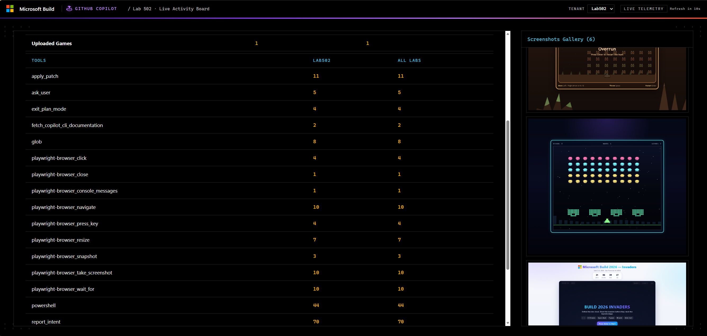
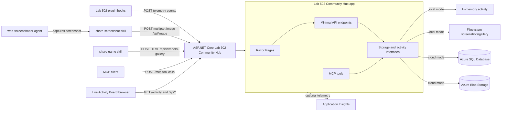
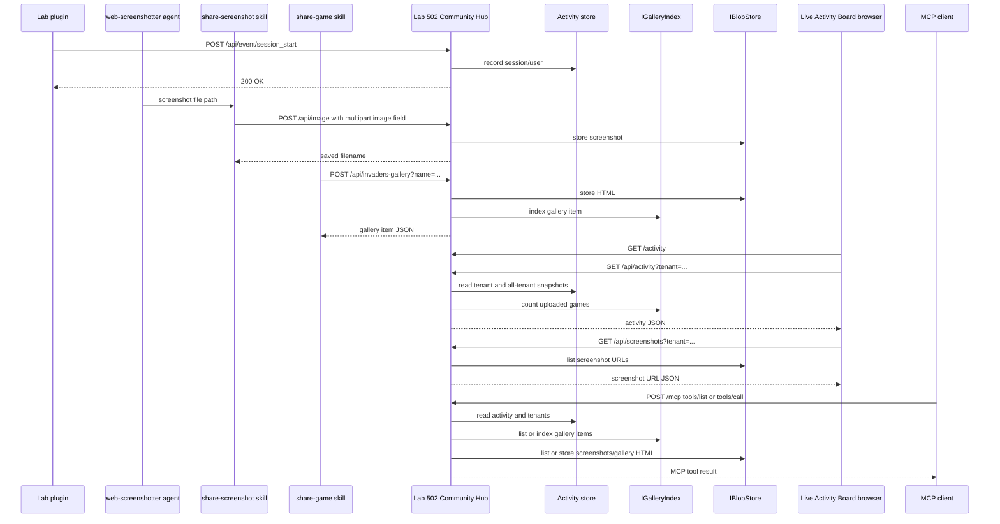
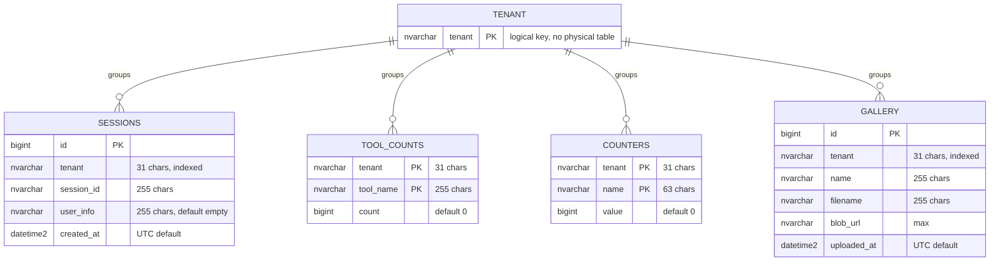
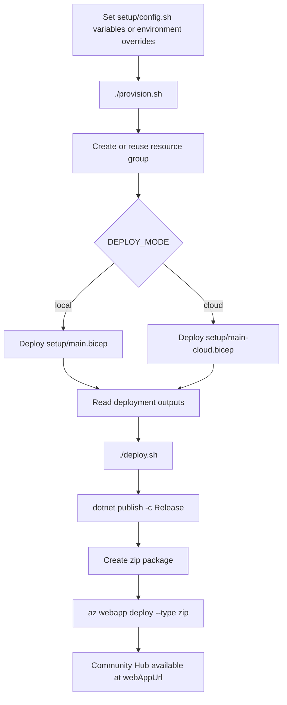

# Lab 502 Community Hub

The .NET Lab 502 Community Hub is an ASP.NET Core service for lab activity and shared attendee artifacts. It receives plugin events, tracks aggregate activity, stores uploaded screenshots and gallery HTML, and renders a Live Activity Board for a selected tenant or all tenants.



## Features

- Live Activity Board at `/activity` with automatic polling.
- Tenant selector with current-tenant and all-tenant rollups.
- Event ingestion endpoints for session starts, tool usage, and subagent completions.
- Screenshot upload, listing, and serving endpoints.
- Space Invaders gallery upload and listing endpoints.
- Stateless HTTP MCP server at `/mcp` for agents and LLM clients.
- Local mode for development with in-memory activity counters and filesystem-backed gallery/screenshot storage.
- Cloud mode for Azure App Service with Azure SQL, Azure Blob Storage, managed identity, and optional Application Insights.
- OpenAPI metadata endpoint at `/api/openapi.json`.

## Project layout

```text
community-hub/
├── CommunityHub/                  # ASP.NET Core app
│   ├── Config/                          # Environment-based configuration
│   ├── Endpoints/                       # Minimal API endpoint mappings
│   ├── Pages/                           # Razor pages
│   └── Services/                        # Local and Azure-backed storage/activity services
├── CommunityHub.Tests/            # Unit tests
├── CommunityHub.IntegrationTests/ # SQL integration tests
└── setup/                               # Azure Bicep templates and deploy scripts
```

## Architecture

The application starts in either `local` or `cloud` mode based on `APP_MODE`.

- `local` mode uses an in-memory activity store, `LocalBlobStore`, and `LocalGalleryIndex`.
- `cloud` mode bootstraps Azure SQL schema and uses SQL-backed activity storage, `SqlGalleryIndex`, and `AzureBlobStore`.
- The Live Activity Board and API endpoints depend on storage abstractions for activity, gallery index, and blobs so local and cloud backends share the same endpoint behavior.



### Runtime request flow



## Database schema

Cloud mode creates the SQL schema on startup if the tables or indexes do not already exist. Tables are tenant-scoped so one deployment can track multiple lab tenants.



> `TENANT` is a logical grouping key, not a physical table.

## Configuration

| Variable | Default | Mode | Description |
|---|---|---|---|
| `APP_MODE` | `local` | all | `local` or `cloud`. |
| `PORT` | `1345` | all | HTTP port bound by Kestrel. |
| `LOCAL_DATA_DIR` | `.` | local | Directory for local screenshots and gallery files. |
| `APP_TENANT` | — | cloud | Active tenant. Must match `^[a-zA-Z0-9][a-zA-Z0-9-]{0,30}$`. |
| `SQL_SERVER` | — | cloud | Azure SQL server fully qualified domain name. |
| `SQL_DATABASE` | `dashboard` | cloud | Azure SQL database name. |
| `AZURE_STORAGE_ACCOUNT` | — | cloud | Azure Storage account name. |
| `AZURE_BLOB_PUBLIC_BASE` | — | cloud | Public base URL for blob links. |
| `APPLICATIONINSIGHTS_CONNECTION_STRING` | — | cloud | Optional Application Insights connection string. |
| `LAB502_DASHBOARD_URL` | `http://localhost:{PORT}` | all | Public Community Hub URL used in generated OpenAPI metadata. |
| `DASHBOARD_URL` | — | all | Fallback public Community Hub URL if `LAB502_DASHBOARD_URL` is not set. |

## Run on a local node

Prerequisites:

- .NET 10 SDK.
- A shell with access to this repository.

From the repository root:

```bash
cd src/community-hub
export APP_MODE=local
export PORT=1345
export LOCAL_DATA_DIR="$PWD/.local-data"
dotnet run --project CommunityHub/CommunityHub.csproj
```

Open <http://localhost:1345/activity>.

You can also build and optionally run with the setup helper:

```bash
cd src/community-hub/setup
./build-local.sh
RUN=1 ./build-local.sh
```

Local mode stores screenshots under `$LOCAL_DATA_DIR/screenshots`, gallery HTML under `$LOCAL_DATA_DIR/gallery`, and keeps runtime activity counters in process memory.

## Provision and deploy to Azure

The `setup` folder contains Bicep templates and scripts for two Azure deployment modes.

### Prerequisites

- .NET 10 SDK.
- Azure CLI logged in with `az login`.
- `jq` and `zip` installed.
- Permission to create resource groups, App Service resources, and, for cloud mode, Azure SQL, Storage, role assignments, Log Analytics, and Application Insights.

### Deployment modes

| Mode | Resources | Persistence |
|---|---|---|
| `local` | Linux App Service Plan + Web App | App Service filesystem and in-memory activity counters. |
| `cloud` | Linux App Service Plan + Web App + Azure SQL + Blob Storage + Application Insights | Azure SQL for activity counters/gallery index and Blob Storage for screenshots/gallery HTML. |

### Local-mode App Service deployment

This provisions only App Service infrastructure and runs the app with `APP_MODE=local`.

```bash
cd src/community-hub/setup
az login

# Optional overrides
export RESOURCE_GROUP=community-hub-rg
export LOCATION=westeurope
export BASE_NAME=commdash
export APP_SERVICE_PLAN_SKU=B1

./provision.sh
./deploy.sh
```

### Cloud-mode deployment

Cloud mode provisions Azure SQL, Blob Storage, App Service, managed identity role assignments, Log Analytics, and Application Insights. The web app uses managed identity through `DefaultAzureCredential`; no SQL passwords, storage keys, or SAS tokens are required by the app.

```bash
cd src/community-hub/setup
az login

export DEPLOY_MODE=cloud
export RESOURCE_GROUP=community-hub-rg
export LOCATION=westeurope
export BASE_NAME=commdash
export APP_TENANT=my-tenant
export SQL_DATABASE=dashboard
export SQL_SERVICE_OBJECTIVE=S1

./provision.sh
./deploy.sh
```

The scripts print deployment outputs including the Web App URL, SQL Server FQDN, Storage account name, and blob public base URL.

### Provision/deploy flow



## Data sent by agents and skills

The Lab 502 Community Hub receives two kinds of community artifacts in addition to telemetry events: screenshots captured by the `web-screenshotter` agent workflow and complete HTML games uploaded by a share-game skill.

### Screenshot data from the agent

The `web-screenshotter` agent captures a browser screenshot to a temporary PNG file, then delegates the upload to the `share-screenshot` skill. The skill posts the binary image to the Lab 502 Community Hub.

| Property | Value |
|---|---|
| Endpoint | `POST /api/image` |
| Request content type | `multipart/form-data` |
| Form field | `image` |
| Payload | Binary image file bytes. Common content types are `image/png`, `image/jpeg`, `image/gif`, `image/webp`, `image/bmp`, or `application/octet-stream`. |
| Filename handling | The original uploaded file extension is preserved when present; the service stores it as a generated GUID filename. If no extension is supplied, `.png` is used. |
| Size limit | 10 MiB request body. |
| Tenant | The active server-side tenant is used. In local mode this is `local`; in cloud mode this is `APP_TENANT`. |
| Success response | Plain text: `Saved as <generated-file-name>`. |
| Side effects | Stores the image in local filesystem or Azure Blob Storage and increments the `screenshots` counter. |

Example upload:

```bash
curl -X POST "$LAB502_DASHBOARD_URL/api/image" \
  -F "image=@/tmp/screenshot_1710000000.png"
```

Screenshot storage by mode:

- Local mode: file is written to `$LOCAL_DATA_DIR/screenshots/<generated-file-name>` and served from `/api/screenshots/<generated-file-name>`.
- Cloud mode: blob is written to `screenshots/<APP_TENANT>/<generated-file-name>` and served from `${AZURE_BLOB_PUBLIC_BASE}/screenshots/<APP_TENANT>/<generated-file-name>`.

The Lab 502 Community Hub lists screenshot URLs with `GET /api/screenshots?tenant=<tenant>`. The `/activity` page polls this endpoint and displays the returned URLs in the screenshot gallery sidebar.

### Share-game data from the skill

The share-game skill uploads the generated Space Invaders game as a single HTML document. The Lab 502 Community Hub stores the HTML file and records an index row so it can be shown in the gallery.

| Property | Value |
|---|---|
| Endpoint | `POST /api/invaders-gallery?name=<display-name>` |
| Request content type | Raw request body. `text/html; charset=utf-8` is recommended. |
| Query string | Optional `name` display name. It is sanitized by the service; if omitted or empty, the service generates a random name. |
| Payload | Complete HTML document bytes for the generated game. The app expects a self-contained HTML file suitable for direct browser loading. |
| Size limit | 200 KB request body. |
| Tenant | The active server-side tenant is used. In local mode this is `local`; in cloud mode this is `APP_TENANT`. |
| Success response | JSON object: `{ "name": "<display-name>", "url": "<served-html-url>" }`. |
| Side effects | Stores the HTML in local filesystem or Azure Blob Storage and inserts a `gallery` index row. |

Example upload:

```bash
curl -X POST "$LAB502_DASHBOARD_URL/api/invaders-gallery?name=My%20Invaders" \
  -H "Content-Type: text/html; charset=utf-8" \
  --data-binary @./invaders.html
```

Game storage by mode:

- Local mode: file is written to `$LOCAL_DATA_DIR/gallery/<generated-guid>.html` and served from `/api/gallery/<generated-guid>.html`.
- Cloud mode: blob is written to `gallery/<APP_TENANT>/<generated-guid>.html` and served from `${AZURE_BLOB_PUBLIC_BASE}/gallery/<APP_TENANT>/<generated-guid>.html`.

The Lab 502 Community Hub lists shared games with `GET /api/invaders-gallery/list?tenant=<tenant>&limit=<n>`. Each response item contains the display `name` and playable `url` for the uploaded HTML game.

## MCP server

The Lab 502 Community Hub exposes a stateless HTTP Model Context Protocol server at `/mcp`. The app explicitly maps `app.MapMcp("/mcp")` because the SDK default route for bare `app.MapMcp()` is the app root. MCP clients should connect to:

```text
http://localhost:1345/mcp
```

Use the deployed Community Hub base URL instead of `localhost` in Azure, for example `${LAB502_DASHBOARD_URL}/mcp`.

The MCP tools are implemented in `CommunityHub/Services/DashboardMcpTools.cs` and delegate to `DashboardOperations`, which is also used by the REST endpoints. This keeps storage behavior, tenant handling, activity side effects, and validation consistent.

| MCP capability | Arguments | Result | Description |
|---|---|---|---|
| `ListGames` | `limit` optional integer, `tenant` optional string | Array of `{ "name": "...", "url": "..." }` | Returns uploaded Space Invaders games for the current or requested tenant. |
| `ListScreenshots` | `tenant` optional string | Array of screenshot URL strings | Returns screenshot URLs for the current or requested tenant. |
| Community activity | `tenant` optional string | Activity JSON with `activity.current_tenant`, `activity.all_tenants`, `tools.current_tenant`, and `tools.all_tenants` | Returns the same activity shape as `/api/activity`. |
| `ListToolUsage` | `tenant` optional string | Array of `{ "name": "...", "count": 0 }` | Returns the per-tool usage breakdown for the current or requested tenant. |
| `ListTenants` | none | `{ "current_tenant": "...", "tenants": ["..."] }` | Returns the active tenant and all discovered tenants. |
| `GetShareGameInstructions` | `htmlPath` optional string, `name` optional string | `{ "upload_url": "...", "example_command": "..." }` | Returns direct upload details and an optional example command for HTML game files. Agents should pass the local path directly, upload the file outside MCP, and never read HTML contents into MCP context. |
| `GetScreenshotUploadInstructions` | `imagePath` optional string | `{ "upload_url": "...", "example_command": "..." }` | Returns direct upload details and an optional example command for screenshot files. Agents should upload the local file directly, not read image bytes into MCP context. |

MCP upload limits:

- Games are uploaded directly to the REST `/api/invaders-gallery` endpoint using the details returned by `GetShareGameInstructions`; HTML file contents should not pass through MCP context.
- Screenshots are uploaded directly to the REST `/api/image` endpoint using the details returned by `GetScreenshotUploadInstructions`; image bytes should not pass through MCP context. The REST endpoint has a 10 MiB multipart request limit.

Invalid tenant names are rejected with the same tenant validation used by the REST APIs. In local mode the current tenant is `local`; in cloud mode it is `APP_TENANT`.

## Main endpoints

| Endpoint | Method | Description |
|---|---|---|
| `/activity` | GET | Live Activity Board page. |
| `/mcp` | POST | Stateless HTTP MCP server endpoint. |
| `/api/activity?tenant=...` | GET | Current and all-tenant activity snapshot. |
| `/api/tenants` | GET | Current tenant plus discovered tenants. |
| `/api/openapi.json` | GET | OpenAPI metadata. |
| `/api/event/session_start?session_id=...&user_info=...` | POST | Records a session and optional user. |
| `/api/event/user_prompt_submitted?session_id=...` | POST | Increments prompt submission counter. |
| `/api/event/tool_used?tool_name=...` | POST | Increments total and per-tool counters. |
| `/api/event/agent_stop?session_id=...` | POST | Increments main agent completion counter. |
| `/api/event/subagent_stop` | POST | Increments subagent completion counter. |
| `/api/image` | POST | Uploads a screenshot as multipart form field `image`. |
| `/api/screenshots?tenant=...` | GET | Lists screenshot URLs. |
| `/api/screenshots/{name}` | GET | Serves a local-mode screenshot file. |
| `/api/invaders-gallery?name=...` | POST | Uploads gallery HTML and indexes it. |
| `/api/invaders-gallery/list?tenant=...&limit=...` | GET | Lists gallery items. |
| `/api/gallery/{name}` | GET | Serves a local-mode gallery HTML file. |

## Build and test

From `src/community-hub`:

```bash
dotnet build CommunityHub.slnx
dotnet test CommunityHub.slnx
```

SQL integration tests require `MSSQL_CONNECTION_STRING` and can be run separately:

```bash
MSSQL_CONNECTION_STRING="Server=...;Database=master;..." \
  dotnet test CommunityHub.IntegrationTests/CommunityHub.IntegrationTests.csproj
```

## Cleanup

To remove Azure resources created by the setup scripts:

```bash
cd src/community-hub/setup
./destroy.sh        # prompts for confirmation
./destroy.sh --yes  # non-interactive
```
